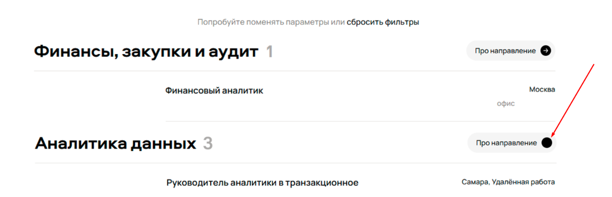
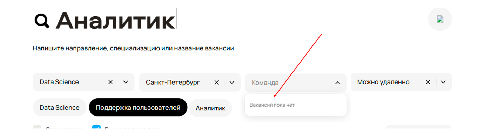
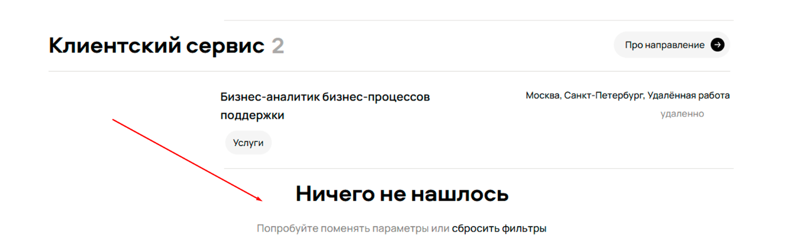
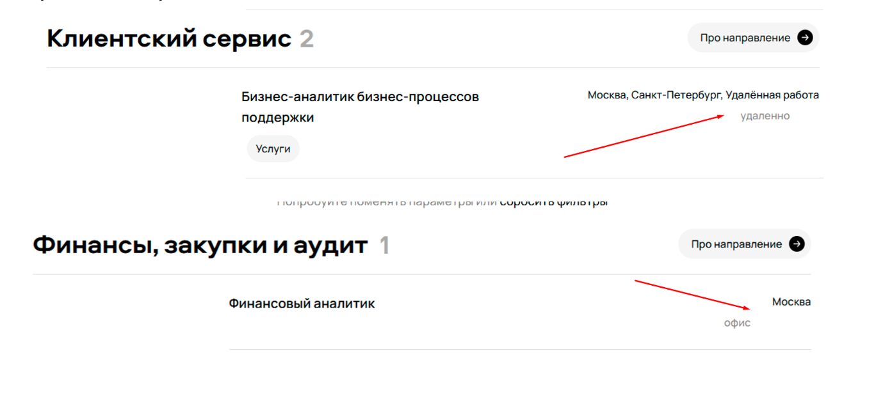
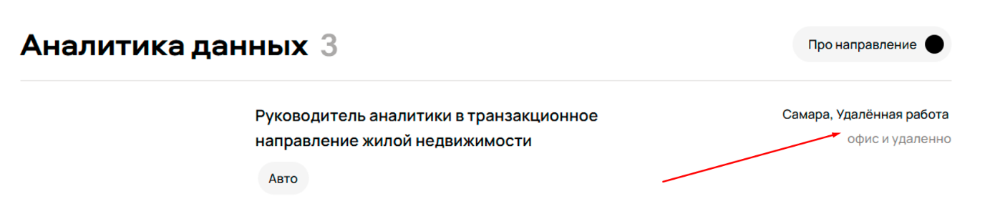
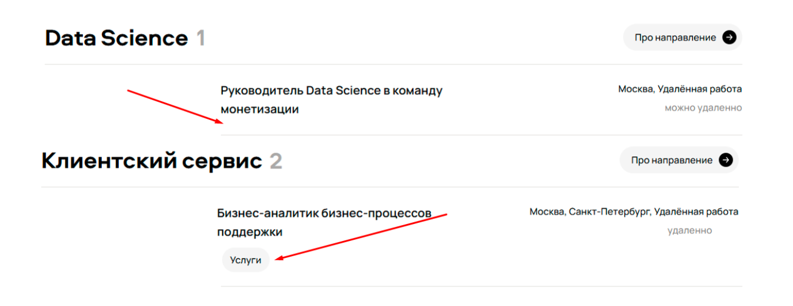

В отчете собраны баги, выявленные в ходе визуального анализа представленного скриншота интерфейса. Поскольку баги были идентифицированы на статическом изображении, такие пункты, как «Шаги воспроизведения» и «Окружение», были исключены из структуры описания.

## **Приоритезация багов**

Приоритеты багам были выставлены по следующей логике:

- Низкий (low): Незначительные дефекты, не оказывающие прямого влияния на ключевые функции или незаметные для большинства пользователей;  
- Средний (medium): Заметные дефекты, которые не блокируют работу, но существенно ухудшают пользовательский опыт;  
- Высокий (high): Дефекты, нарушающие ключевую функциональность и напрямую мешающие выполнению целевых действий пользователем;  
- Критический (critical): Дефекты, которые полностью блокируют ключевой функционал системы, делая его недоступным для пользователей, либо приводящие к потере данных;

## **Разделение на виды багов**

Все баги разделены на две основные категории для удобства маршрутизации и приоритизации:

- Функциональные баги (Functional Bugs): Ошибки в логике работы приложения, когда система ведет себя неправильно или не в соответствии с техническим заданием.  
- UI баги (User Interface Bugs): Ошибки в визуальном представлении или взаимодействии с элементами интерфейса, не затрагивающие базовую логику.

## **UI баги**

### 1. Не отображается кнопка поиска
|||
| :---- | :---- |
| Описание | На главной странице раздела поиска вакансий отсутствует кнопка "Найти" или "Поиск" |
| Текущий результат |  |
| Ожидаемый результат | Кнопка поиска отображается и является кликабельной. |
| Приоритет | Средний |

### 2. Некорректно отображается кнопка "Про направление"
|||
| :---- | :---- |
| Описание | В блоке "Аналитика данных" кнопка "Про направление" имеет визуальные дефекты, отображается не полностью. |
| Текущий результат |  |
| Ожидаемый результат | Кнопка должна отображаться корректно |
| Приоритет | Низкий |

### 3. Ошибка в выпадающем списке выбора команды 
|||
| :---- | :---- |
| Описание | При открытии выпадающего списка для выбора команды, если список пуст, отображается сообщение "Вакансий пока нет". |
| Текущий результат |  |
| Ожидаемый результат | Сообщение должно соответствовать контексту: "Команд пока нет" или "Нет доступных команд". |
| Приоритет | Низкий |

### 4. Не отображается вакансия из блока “Клиентский сервис”
|||
| :---- | :---- |
| Описание | При переходе в направление "Клиентский сервис" одна из вакансий не отображается. Вместо карточки вакансии показывается интерфейс ошибки. |
| Текущий результат |  |
| Ожидаемый результат | Все вакансии в направлении отображаются корректно. |
| Приоритет | Критический |

### 5. Неконсистентность формата отображения локации и формата работы в карточках вакансий
|||
| :---- | :---- |
| Описание | В списке вакансий отсутствует единый формат отображения информации о локации и формате работы. В результате данные выводятся в разной структуре, что усложняет их восприятие и выглядит неаккуратно. |
| Текущий результат | Формат отображения отличается от вакансии к вакансии:   |
| Ожидаемый результат | Все карточки вакансий должны иметь единую, заранее определенную структуру для отображения локации и формата работы. |
| Приоритет | Средний |

### 6. Противоречивая информация о формате работы внутри одной вакансии
|||
| :---- | :---- |
| Описание | В карточке вакансии "Руководитель аналитики в транзакционное направление жилой недвижимости" указаны взаимоисключающие данные о формате работы. Это вводит пользователя в заблуждение. |
| Текущий результат |  |
| Ожидаемый результат | Информация о формате работы должна быть однозначной и непротиворечивой во всех полях карточки вакансии. |
| Приоритет | Средний |

### 7. Неконсистентное отображение категории/специализации вакансии
|||
| :---- | :---- |
| Описание | В карточках вакансий отсутствует единый подход к отображению категории или специализации. В некоторых вакансиях эта информация присутствует в виде отдельного тега, в других — полностью отсутствует, что создает визуальную несбалансированность и усложняет быстрое сканирование информации. |
| Текущий результат |  |
| Ожидаемый результат | У всех вакансий в списке должна отображаться категория/специализация в виде тега или текстового блока. Если категория не назначена, должно отображаться значение по умолчанию (например, "Общее направление") или данный блок должен быть скрыт для всех вакансий единообразно. |
| Приоритет | Средний |

## **Функциональные баги**

### 8. Не работает фильтр формата работы
|||
| :---- | :---- |
| Описание | При активации фильтра "Можно удалённо" в результатах поиска отображаются вакансии, которые предусматривают только работу из офиса. |
| Текущий результат | Фильтр игнорируется, результаты не соответствуют критерию. |
| Ожидаемый результат | В результатах поиска отображаются только те вакансии, которые соответствуют выбранному формату работы. |
| Приоритет | Высокий |

### 9. Не работает фильтр "Руководящая роль"
|||
| :---- | :---- |
| Описание | При включении чекбокса "Руководящая роль" в результатах поиска, наряду с руководящими, отображаются вакансии рядовых специалистов. |
| Текущий результат | Фильтр не применяется, или применяется некорректно. |
| Ожидаемый результат | В результатах поиска отображаются исключительно вакансии на руководящие должности. |
| Приоритет | Высокий |

### 10. Конфликт логики фильтрации по направлениям
|||
| :---- | :---- |
| Описание | Логика работы фильтров "Направление" (выпадающий список) и "Быстрые кнопки направлений" противоречива. При одновременном выборе направления "Data Science" в списке и "Поддержка пользователей" через кнопку, в результатах показываются вакансии из всех направлений (включая "Аналитику"). |
| Текущий результат | Фильтры не работают либо работают некорректно, показывая нерелевантные результаты. |
| Ожидаемый результат | Система должна фильтровать вакансии в соответствии с выбранным направлением (либо по одному выбранному, либо по их логическому объединению, в зависимости от ТЗ). |
| Приоритет | Высокий |

### 11. Не работает фильтр выбора города
|||
| :---- | :---- |
| Описание | На скриншоте видно, что для поиска вакансий выбран город Санкт-Петербург, однако вакансии предлагаются и в офисе Москвы. |
| Текущий результат | Фильтры не работают либо работают некорректно, показывая нерелевантные результаты. |
| Ожидаемый результат | Система должна фильтровать вакансии в соответствии с выбранным городом для работы. |
| Приоритет | Высокий |
